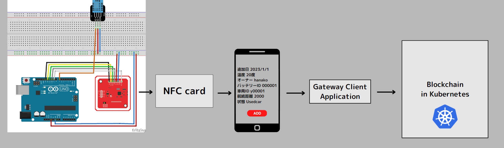

## Prototype application of EV battery supply chain system

This is a prototype application development of my proposed EV battery supply chain system.

### Overview

This diagram shows an overview of this prototype system.

This is the system flow at this time.

1. Using the Arduino as a battery management system, the temperature sensor values and pre-set battery information are combined and written to the NFC card.

2. Bring the smart phone and the card close together and press the read button to read the information written on the NFC card.

3. The information read is added to the blockchain.

* [to android-app-overview](#Android application overview)
* [to arduino](#Arduino overview)
