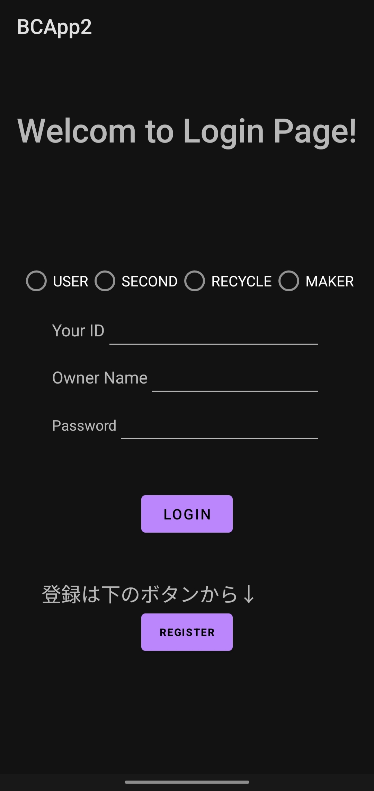
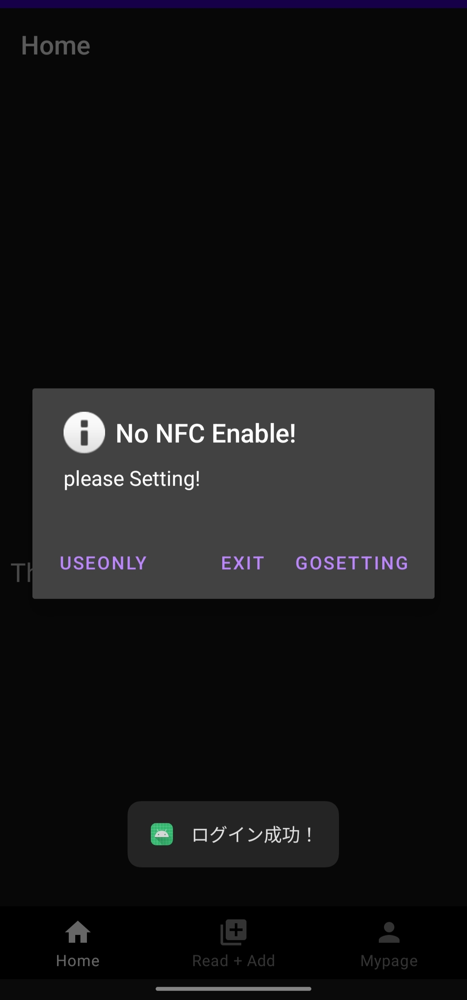
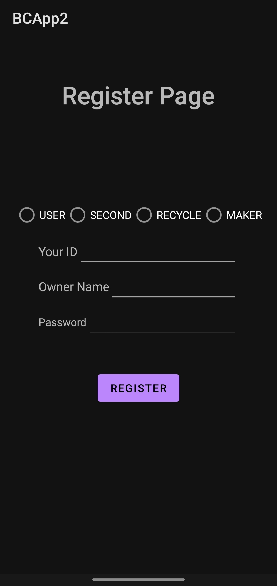
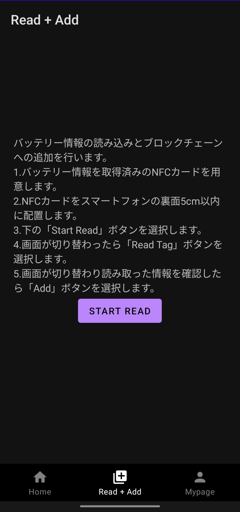
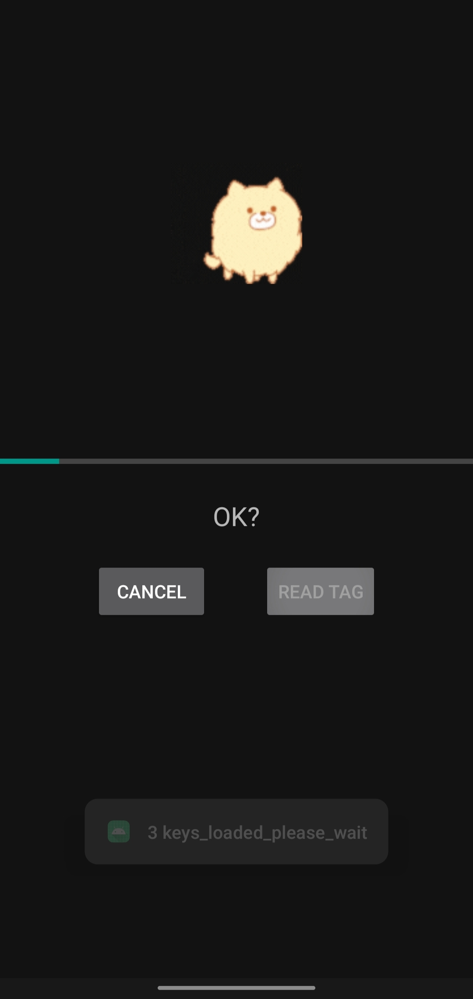
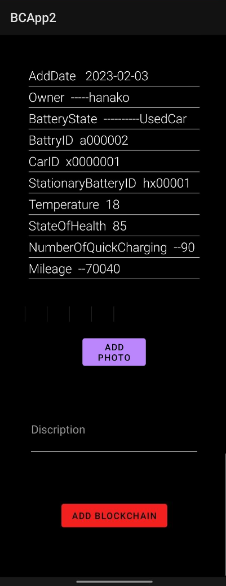

## Android application overview

This section describes the application under development.

### Function

- [Login and Register](#login)
- [Reading from NFC cards](#read-fragment)
- [Adding to the blockchain](#adding-to-the-blockchain)

---

### Login

When the application is launched, it starts with a login screen.

If you have previously registered on [the Register page](#register), you will be successfully logged in and taken to Home fragment.

If you enter incorrect information, a toast message will appear prompting you to enter it again.

At that time, if the NFC function of the device is off, the following warning will appear.

- USEONLY : The read function is not used and only browses the application.
- EXIT : Exit this application.
- GOSETTING : Go to the device's NFC settings screen.

### Register

If you have not registered, you can do so on this page.

- USER,SECOND,RECYCLE,MAKER : Select one field name for the organization.
- Your ID : Enter any user ID number. (a number of up to 18 digits)
- Owner Name : Enter any user name. (up to 11 alphanumeric characters)
- Password : Please enter any password. (up to 30 alphanumeric characters)

### Server

This login system uses Microsoft SQL Server.

### Read Fragment

Check the notes in this fragment. When ready, press the Read button.

You will then be taken to a screen with a cute dog moving.

### Reading from NFC cards

Bring the NFC card and device closer together until they are recognized.

Press the Read start button and wait until the next screen appears.

### Adding to the blockchain

Once the read information is confirmed, press the Add button at the bottom.

