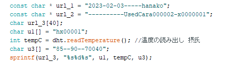

## Arduino overview

Here is an overview of Arduino and NFC.

### Function

- [Acquisition of sensor information and writing to NFC card](#acquisition-of-sensor-information-and-writing-to-nfc-card)
- [Editing Sector Trailers](#editing-sector-trailers)
- [Memory dump](#memory-dump)
- [Initialization to factory defaults](#initialization-to-factory-defaults)

---

### Acquisition of sensor information and writing to NFC card

[This code](../arduino-nfc/mifareclassic_addv2.ino) allows you to do the following : 

- Acquisition of temperature sensor information

- Writing of temperature sensor information and pre-set battery information to NFC card

This image shows the value set for this time.

### Editing Sector Trailers

[This code](../arduino-nfc/mifareclassic_keyset.ino) allows you to set the sector trailer for the NFC card memory information.

### Memory dump

[This code](../arduino-nfc/mifareclassic_memdump2.ino) allows you to check the information in each block of memory in the NFC card.

### Initialization to factory defaults

[This code](../arduino-nfc/mifareclassic_reset.ino) allows you to initialize NFC card memory information to factory defaults.

---

### Reference

If you would like more information, please refer to the following links.

Mifare Classic card User Manual : [here](https://shop.sonmicro.com/Downloads/MIFARECLASSIC-UM.pdf)

PN532 User Manual : [here](https://www.nxp.com/docs/en/user-guide/141520.pdf)
