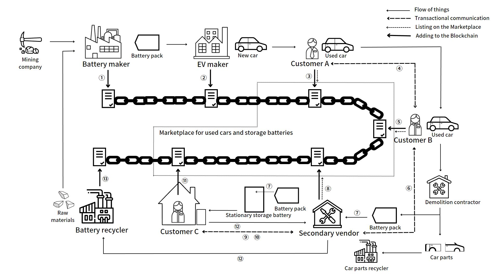

### The purpose of this system

Q : Why did you create this system?

A : To demonstrate the feasibility of my proposed supply chain system.

Q : What is your proposed supply chain system?

A : It is a blockchain-based EV battery supply chain system. The figure below shows an overview.

### Features of the proposed system

What's new about this system is that

1. the blockchain will enable private transactions of used cars and storage batteries.

2. A system that provides a financial return to all past owners of the battery when it is recycled.
